# Mermaid 语法
这里介绍Mermaid各种图表的语法与示例。

---

## [流程图](https://www.wolai.com/dPP2oe92iZRsfLM5cCsX6W)

## 基本语法

所有流程图Flowchart均由**节点**，几何形状和**连线**，箭头或线条组成。Mermaid代码定义了这些节点和边的组成和交互方式。

你还可以选择不同的箭头类型，多方向箭头以及与子图之间的链接。

> 注意：请勿将关键字 `end`用于流程图的节点名称。将所有或任何一个字母大写，以防止流程图中断，例如“End” 或 “END”。

## 一个节点（默认）

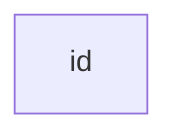

> **注意** `id`即显示在矩形中的名称。

## 一个包含文本的节点

也可以在矩形框中设置与id不同的文本。如果多次设定文本，节点会使用最后一段文本用于显示。另外，如果稍后为节点定义连线，则可以省略文本定义。渲染矩形框时将使用之前定义的文本。

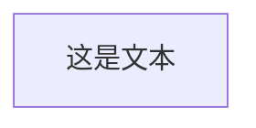

## 图

这条语句声明了流程图的方向。

下述代码声明了流程图是从上到下的（`TD`或`TB`）。

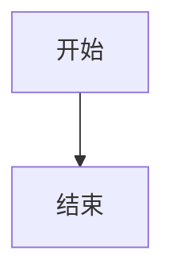

下述代码声明了流程图是从左到右的（`LR`）。

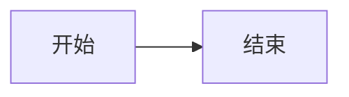

## 流程图方向

可设置的流程方向有：

-   TB - 从上到下
-   TD - 从上到下（和TB相同）
-   BT - 从下到上
-   RL - 从右到左
-   LR - 从左到右

## 节点形状

### 圆角矩形节点

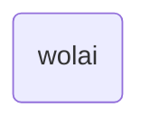

### 运动场形状节点

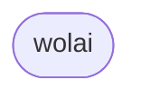

### 子程序形状节点

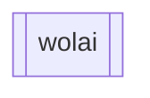

### 圆柱形节点

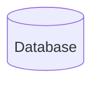

### 圆形节点

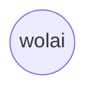

### 鱼尾旗形状节点

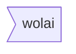

目前只有向右的鱼尾旗形状可用（反过来是不行的，未来可能会优化）。

### 菱形节点

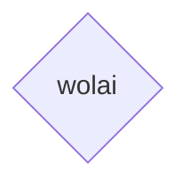

### 六边形节点

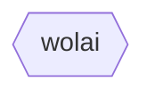

### 平行四边形节点

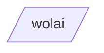

### 平行四边形节点（不同方向）

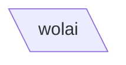

### 梯形节点（下宽上窄）

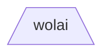

### 梯形节点（上宽下窄）

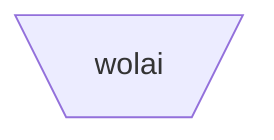

## 节点之间的连接

节点可以用连线进行连接。可以用不同类型的边线连接节点或将文字附加在连线上。

### 带箭头的连接

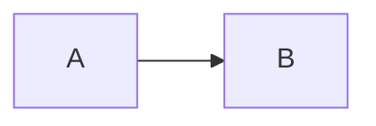

### 开放式连接

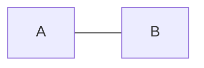

### 带文字的连接

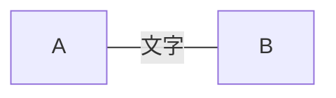

或者


### 带文字和箭头的连接

```mermaid
flowchart LR
    A-->|文字|B
```

或者

```mermaid
flowchart LR
    A-- 文字 -->B
```

### 虚线连接

```mermaid
flowchart LR;
   A-.->B;
```

### 带文字的虚线连接

```mermaid
flowchart LR
   A-. 文字 .-> B
```

### 加粗的连接

```mermaid
flowchart LR
   A ==> B
```

### 带文字的加粗连接

```mermaid
flowchart LR
   A == 文字 ==> B
```

### 一串连接

可以在一行中声明多个连接：

```mermaid
flowchart LR
   A -- 文字 --> B -- 文字 --> C
```

也可以在同一行中声明多个节点连接：

```mermaid
flowchart LR
   a --> b & c--> d
```

可以以非常简洁的方式描述依赖关系，如下所示一行代码：

```mermaid
flowchart TB
    A & B--> C & D
```

同样的图形，如果使用基本语法，需要四行代码。但也请注意，这可能会使流程图难以以Markdown形式阅读。我想到了瑞典语单词`lagom`，意思是：不要太多也不要太少。

下面的代码和上面的一行代码等价：

```mermaid
flowchart TB
    A --> C
    A --> D
    B --> C
    B --> D
```

### 新的箭头类型

以下是支持的新类型的箭头：

```mermaid
flowchart LR
    A --o B
    B --x C
```

### 多方向箭头

```mermaid
flowchart LR
    A o--o B
    B <--> C
    C x--x D
```

### 连接线的最小长度

流程图中的每个节点最终被分配到所呈现的图形中的一个级别，即被分配到垂直或水平级别 (取决于流程图的方向)，基于它所连接的节点。默认情况下，连接可以跨越任意数量的级别，但是您可以通过在连接定义中添加额外的破折号来指定一个连接比其他连接更长。

在下面的示例中，从节点B到节点E的连接中添加了两个额外的破折号，因此它比常规连接跨越了多两个级别：

```mermaid
flowchart TD
    A[开始] --> B{判断?};
    B -->|Yes| C[OK];
    C --> D[重新想想];
    D --> B;
    B ---->|No| E[结束];
```

> **注意：**渲染引擎可能会使连接长于定义的级别，以适应其他连接。

当连接标签写在连接的中间时，必须在连接的右侧添加额外的破折号。下面的例子和上述等价：

```mermaid
flowchart TD
    A[开始] --> B{判断?};
    B -- Yes --> C[OK];
    C --> D[重新想想];
    D --> B;
    B -- No ----> E[结束];
```

对于虚线或加粗的连接线，使用的字符看上去是同样的形状，如下表所示：

**长度**

**1**

**2**

**3**

普通

`---`

`----`

`-----`

普通带箭头

`-->`

`--->`

`---->`

加粗

`===`

`====`

`=====`

加粗带箭头

`==>`

`===>`

`====>`

虚线

`-.-`

`-..-`

`-...-`

虚线带箭头

`-.->`

`-..->`

`-...->`

## 中断语法的特殊字符

可以将文本放在引号中，以渲染会引起歧义的文字。如下例所示：

```mermaid
flowchart LR
    id1["这是 (text) 文本"]
```

### 转义字符的实体代码

可以使用下述示例的语法转义字符：

```mermaid
flowchart LR
    A["一个双引号:#quot;"] -->B["一个十进制数字表示的符号:#9829;"]
```

数字为十进制，因此 # 符号可以编码为 `#35;`。此外，也支持使用HTML字符名称。

## 子图

```mermaid
subgraph title
    graph definition
end
```

一个例子：

```mermaid
flowchart TB
    c1-->a2
    subgraph A
    a1-->a2
    end
    subgraph B
    b1-->b2
    end
    subgraph C
    c1-->c2
    end
```

您还可以为子图设置id：

```mermaid
flowchart TB
    c1-->a2
    subgraph ide1 [A]
    a1-->a2
    end
```

## 多子图流转

在多个子图中，可以在子图之间设置连接线，如下面的例子所示：

```mermaid
flowchart TB
    c1-->a2
    subgraph A
    a1-->a2
    end
    subgraph B
    b1-->b2
    end
    subgraph C
    c1-->c2
    end
    A --> B
    C --> B
    B --> c2
```

## 子图的方向

在多个流程图中，您可以使用方向语句来设置子图将呈现的方向，就像下面的例子所示：

```mermaid
flowchart LR
  subgraph TOP
    direction TB
    subgraph B1
        direction RL
        i1 -->f1
    end
    subgraph B2
        direction BT
        i2 -->f2
    end
  end
  A --> TOP --> B
  B1 --> B2
```

## 交互

可以在节点上定义点击时跳转到超链接。

默认情况下，超链接在同一浏览器选项卡/窗口中打开。可以通过在click定义中添加链接目标来更改此设置 （支持 `_self`，`_blank`，`_parent`和 `_top`）：

```mermaid
flowchart LR;
    A-->B;
    B-->C;
    C-->D;
    D-->E;
    click A "http://www.wolai.com/downloads" _blank
    click B "http://www.wolai.com/downloads" "Open this in a new tab" _blank
    click C href "http://www.wolai.com/downloads" _blank
    click D href "http://www.wolai.com/downloads" "Open this in a new tab" _blank
```

## 注释

可以在流程图中输入注释，解析器将忽略该注释。注释需要在独立的行内，并且必须以`%%` 开头。注释开始到下一个换行符之后的任何文本都将被视为注释，包括任何流程图语法：

```mermaid
flowchart LR
%% this is a comment A -- text --> B{node}
   A -- text --> B -- text2 --> C
```

## 样式和类 class

### 连接线样式

可以对连接线进行样式设置。例如，您可能希望对流程中倒退的连接线进行样式设置。因为连接不像节点那样可以设置id，所以需要其他确定连接应附加到哪种样式的方法。

使用在流程图中定义连接的序号指定连接。在下面的示例中，在linkStyle语句中定义的样式将属于图中的第四个连接：

```mermaid
linkStyle 3 stroke:#ff3,stroke-width:4px,color:red;
```

### 节点样式

可以为节点定义指定的样式，例如更粗的边框或不同的背景色：

```mermaid
flowchart LR
    id1(开始)-->id2(结束)
    style id1 fill:#f9f,stroke:#333,stroke-width:4px
    style id2 fill:#bbf,stroke:#f66,stroke-width:2px,color:#fff,stroke-dasharray: 5 5
```

### 类 Class

比每次定义样式更方便的是定义一个样式class，并将该class添加到不同的节点上。

class定义如下所示：

```mermaid
classDef className fill:#f9f,stroke:#333,stroke-width:4px;
```

将class添加到节点的示例如下：

```mermaid
class nodeId1 className;
```

也可以用一条语句将一个class添加到一系列的节点上：

```mermaid
class nodeId1,nodeId2 className;
```

添加class的一种更短的形式是使用 `:::` 运算符将classname添加到节点，如下所示：

```mermaid
flowchart LR
    A:::someclass --> B
    classDef someclass fill:#f96;
```

### 默认 class

如果一个class被命名为default，它的样式将被分配给所有没有指定class的节点。

```mermaid
classDef default fill:#f9f,stroke:#333,stroke-width:4px;
```

## 对fontawesome图标的基本支持（在wolai中暂不支持）

可以在文本中添加fontawesome图标。

使用语法`fa:#icon` 来显示一个图标。

```mermaid
flowchart TD
    B["fa:fa-twitter for peace"]
    B-->C[fa:fa-ban forbidden]
    B-->D(fa:fa-spinner spin);
    B-->E(A fa:fa-camera-retro perhaps?);
```

## 顶点和连接线之间有空格且没有分号的图声明

-   在图的声明中，语句现在也可以在没有分号的情况下结束。在0.2.16版本之后，用分号结束图形语句是可选的。因此，下面的图声明与图的过往声明同样有效。
-   在顶点和连接之间允许使用单个空格。但是，顶点及其文本与连接及其文本之间不应存在任何空格。图声明的旧语法也将起作用，因此此新功能是可选的，并被引入以提高可读性。

下面是流程图边线的新的声明方式，和过去的语法同样有效。

```mermaid
flowchart LR
    A[Hard edge] -->|Link text| B(Round edge)
    B --> C{Decision}
    C -->|One| D[Result one]
    C -->|Two| E[Result two]
```

[时序图](https://www.wolai.com/6jjLEWyGrLKVdWE4fEcHKR)

> 时序图Sequence Diagram是一种交互图，显示了流程如何彼此操作以及以什么顺序进行操作。

Mermaid可以渲染时序图。

```mermaid
sequenceDiagram
    老马->>老铁: 老铁，好么？
    老铁-->>老马: 好!
    老马-)老铁: 再见！
```

**注意：**由于Mermaid语法的特性，“end” 一词可能会中断图表语法的解析。如果一定要使用“end”，则必须使用括号 `()`，引号 `""` 或括号 `{}`，`[]` 来括起“end”。即 `(end)` 、`[end]` 、`{end}`。

## 语法

### 参与者 Participants

可以像上面第一个示例中一样隐式定义参与者。参与者或角色的渲染由定义中出现的顺序决定。有时，您可能希望以与参与者在第一条消息中显示的顺序不同的顺序显示参与者。可以通过执行以下操作来指定角色的出现顺序：

```mermaid
sequenceDiagram
    participant 老马
    participant 小宝
    老马->>小宝: 好啊，小宝！
    小宝->>老马: 你也好！
```

### 角色 Actors

如果你要使用角色符号而不是带有文本的矩形框表示参与者，则可以使用actor语句，如下所示：

```mermaid
sequenceDiagram
    actor 老马
    actor 小宝
    老马->>小宝: 你好，宝
    小宝->>老马: 你好，老马
```

### 别名Aliases

角色可以以别名的形式定义一个方便输入的id：

```mermaid
sequenceDiagram
    participant M as 老马
    participant L as 老铁
    M->>L: 好啊，老铁！
    L->>M: 你也好！
```

## 消息Messages

消息既可以实线，也可以虚线显示。

```mermaid
[Actor][Arrow][Actor]:Message text
```

目前支持的箭头有6种：

**类型**

**描述**

->

无箭头实线

-->

无箭头虚线

->>

带箭头实线

-->>

带箭头虚线

-x

带×的实线

--x

带×的虚线

-)

带开放箭头的实线

--)

带开放箭头的虚线

## 激活期Activations

可以激活和停用角色。激活/停用可以显式声明：

```mermaid
sequenceDiagram
    老马->>老铁: 好啊，老铁！
    activate 老铁
    老铁-->>老马: 好！
    deactivate 老铁
```

通过在消息箭头上附加`+`/`-` 后缀的快捷表示法：

```mermaid
sequenceDiagram
    老马->>+老铁: 好啊，老铁！
    老铁-->>-老马: 好！
```

可以为同一角色堆叠多个激活：

```mermaid
sequenceDiagram
    老马->>+老铁: 好啊，老铁！
    老马->>+老铁: 老铁，听见我没？
    老铁-->>-老马: 老马，我听到了！
    老铁-->>-老马: 我已出舱，感觉良好！
```

## 注解Notes

可以在序列图中添加注解。通过语法 Note [ right of | left of | over ] [Actor]：注解内容

参见下面的示例：

```mermaid
sequenceDiagram
    participant 老马
    Note right of 老马: 这是一句注解
```

也可以创建跨越两个参与者的注解：

```mermaid
sequenceDiagram
    老马->老铁: 好啊，老铁！
    Note over 老马, 老铁: 一个典型的交互
```

## 循环Loops

可以在时序图中表现循环，通过如下语法：

```mermaid
loop Loop text
... statements ...
end
```

参见下面的示例：

```mermaid
sequenceDiagram
    老马->老铁: 好啊，老铁！
    loop 每分钟一次
        老铁-->老马: 好啊！
    end
```

## 抉择Alt

可以在时序图中表现抉择路径，通过如下语法：

```mermaid
alt Describing text
... statements ...
else
... statements ...
end
```

或者如果有时序是可选的 (如果没有其他)。

```mermaid
opt Describing text
... statements ...
end
```

参见下面的示例：

```mermaid
sequenceDiagram
    老马->>小宝: 咋样啊，小宝！
    alt 黄码
        小宝->>老马: 我隔离呢！
    else 绿码
        小宝->>老马: 倍儿棒！
    end
    opt 额外的应答
        小宝->>老马: 感谢关心！
    end
```

## 并行Parallel

可以显示并行发生的动作，通过下面的语法：

```mermaid
par [Action 1]
... statements ...
and [Action 2]
... statements ...
and [Action N]
... statements ...
end
```

参见下面的示例：

```mermaid
sequenceDiagram
    par 老马 to 小宝
        老马->>小宝: 好啊，兄弟们！
    and 老马 to 老铁
        老马->>老铁: 好啊，兄弟们！
    end
    小宝-->>老马: 好啊，老马！
    老铁-->>老马: 好啊，老马！
```

也可以嵌套并行的块：

```mermaid
sequenceDiagram
    par 老马 to 小宝
        老马->>小宝: 去帮帮老铁！
    and 老马 to 老铁
        老马->>老铁: 今天这个要做完！
        par 老铁 to 老四
            老铁->>老四: 我们今天一起把这个做完吧？
        and 老铁 to 二丫
            老铁->>二丫: 你今天可以协助我吗？
        end
    end
```

## 背景高亮Background Highlighting

可以通过提供指定颜色的背景来突出动作流，通过下面的语法：

（颜色使用rgb和rgba语法定义）

```mermaid
rect rgb(184, 76, 78)
... content ...
end
```

```mermaid
rect rgba(184, 76, 78, .1)
... content ...
end
```

参见下面的示例：

```mermaid
sequenceDiagram
    participant 老马
    participant 老铁

    rect rgb(184, 76, 78)
    note right of 老马: 老马呼叫老铁
    老马->>+老铁: 好啊，老铁！
    rect rgb(42, 143, 244)
    老马->>+老铁: 老铁，听到我喊你吗？
    老铁-->>-老马: 老马，我听到了！
    end
    老铁-->>-老马: 我挺好！
    end
    老马 ->>+老铁: 今晚一起喝一杯？
    老铁 -->>-老马: 不见不散！

```

## 注释

可以在时序图代码中写注释，解析器将忽略这些注释。注释需要写在单独的行，并且必须以 `%%` 开头。注释开始到下一个换行符之后的任何文本都将被视为注释，包括任何时序图语法。

```mermaid
sequenceDiagram
    老马->>老铁: 好啊，老铁！
    %% 这里是注释，图中不起作用
    老铁-->>老马: 好！
```

## 字符转义

可以使用如下所示的语法转义字符：

```mermaid
sequenceDiagram
    老铁->>二丫: 我 #9829; 你！
    二丫->>老铁: 我 #9829; 你 #infin; 次！
```

可以在时序图中获得添加到每个箭头的序列号，语法如下：

```mermaid
sequenceDiagram
    autonumber
    老马->>老铁: 好啊，老铁！
    loop 体检
        老铁->>老铁: 与新冠做斗争
    end
    Note right of 老铁: 理性的思考
    老铁-->>老马: 我好了!
    老铁->>小宝: 你呢？
    小宝-->>老铁: 我身体倍儿棒！
```

## 角色菜单Actor Menus

角色可以定义一个弹出菜单，其中包含指向外部页面的自定义链接。例如，如果角色代表一个web服务，则有用的链接可能包括指向服务运行状况的仪表板的链接，包含服务源代码的代码库或或描述该服务的wiki页面。

可以通过以下语法为角色添加一个或多个链接：

```mermaid
link <actor>: <link-label> @ <link-url>
```

```mermaid
sequenceDiagram
    participant 老马
    participant 老铁
    link 老马: Dashboard @ https://dashboard.contoso.com/alice
    link 老马: Wiki @ https://wiki.contoso.com/alice
    link 老铁: Dashboard @ https://dashboard.contoso.com/john
    link 老铁: Wiki @ https://wiki.contoso.com/john
    老马->>老铁: 好啊，老铁！
    老铁-->>老马: 好！
    老马-)老铁: 回见！
```

#### 高级菜单语法Advanced Menu Syntax

There is an advanced syntax that relies on JSON formatting. If you are comfortable with JSON format, then this exists as well. 高级菜单语法依赖于JSON格式。如果你了解JSON格式，可以使用下面的语法：

```mermaid
links <actor>: <json-formatted link-name link-url pairs>
```

参见下面的示例：

```mermaid
sequenceDiagram
    participant 老马
    participant 老铁
    links 老马: {"Dashboard": "https://dashboard.contoso.com/alice", "Wiki": "https://wiki.contoso.com/alice"}
    links 老铁: {"Dashboard": "https://dashboard.contoso.com/john", "Wiki": "https://wiki.contoso.com/john"}
    老马->>老铁: 好啊，老铁！
    老铁-->>老马: 好！
    老马-)老铁: 回见！
```

[类图](https://www.wolai.com/u6UNRLnwm9uh9VYvZM7JY7)

> 在软件工程中，统一建模语言 (UML) 中的类图Class Diagram是一种静态结构图，它通过显示系统的类、它们的属性、操作 (或方法) 以及对象之间的关系来描述系统的结构。

——维基百科

类图是面向对象建模的主要构建块。它用于应用程序结构的一般概念建模，以及用于将模型转换为编程代码的详细建模。类图也可以用于数据建模。类图中的类既表示主要元素，应用程序中的交互作用，也表示要编程的类。

Mermaid可以渲染类图：

```mermaid
classDiagram
     动物 <|-- 鸭子
     动物 <|-- 鱼
     动物 <|-- 大象
     动物 : +int age
     动物 : +String gender
     动物: +isMammal()
     动物: +mate()
     class 鸭子{
         +String beakColor
         +swim()
         +quack()
     }
     class 鱼{
         -int sizeInFeet
         -canEat()
     }
     class 大象{
         +bool is_wild
         +run()
     }

```

## 语法

### 类

UML提供了表示类成员的机制，例如属性和方法，以及关于它们的附加信息。

图中类的单个实例包含三个部分（compartment）：

-   顶部部分包含类名称。它以粗体和居中显示，第一个字母大写。它还可以包含描述类性质的可选注释文本。
-   中间部分包含类的属性。左对齐，第一个字母小写。
-   底部部分包含类可以执行的操作。左对齐，第一个字母小写。

```mermaid
classDiagram
    class BankAccount
    BankAccount : +String owner
    BankAccount : +Bigdecimal balance
    BankAccount : +deposit(amount)
    BankAccount : +withdrawl(amount)

```

## 定义一个类

两种方式定义类：

-   使用像诸如`class Animal`这样的关键字显式定义类。
-   通过对象之间的关系定义两个类：`Vehicle <|-- Car`，这条语句定义了两个类，分别是车辆和汽车及其从属关系。

```mermaid
classDiagram
    class Animal
    Vehicle <|-- Car
```

命名约定：类名应由字母数字 (允许使用unicode) 和下划线字符组成。

## 定义类的成员

UML提供了表示类成员的机制，例如属性和方法，以及关于它们的附加信息。

Mermaid根据括号 `()` 是否存在来区分属性和函数/方法。带有 `()` 的被视为函数/方法，其他被视为属性。

定义类的成员有两种方法，无论使用哪种语法来定义成员，输出都是相同的。两种不同的方式是：

-   使用 `:` 关联类的成员，在后面跟随成员名称，用于一次定义一个成员。例如：

```mermaid
classDiagram
class BankAccount
BankAccount : +String owner
BankAccount : +BigDecimal balance
BankAccount : +deposit(amount)
BankAccount : +withdrawal(amount)
```

-   使用 `{}` 关联类的成员，成员被分组在花括号中。适用于一次定义多个成员。例如：

```mermaid
classDiagram
class BankAccount{
    +String owner
    +BigDecimal balance
    +deposit(amount)
    +withdrawl(amount)
}
```

返回类型

可选地，您可以在定义结束时设定返回的数据类型 （注意：最终的方法定义和返回类型之间必须有一个空格来结束方法/函数定义），示例：

```mermaid
classDiagram
class BankAccount{
    +String owner
    +BigDecimal balance
    +deposit(amount) bool
    +withdrawl(amount) int
}
```

#### 通用类型

可以使用通用类型（例如`List<int>`），对于字段、参数和返回类型，方法是将类型封装在`~`（波浪号）中。注意：当前不支持嵌套类型声明（例如`List<List<int>>`）。

这可以作为任何一个类定义方法的一部分来完成：

```mermaid
classDiagram
class Square~Shape~{
    int id
    List~int~ position
    setPoints(List~int~ points)
    getPoints() List~int~
}

Square : -List~string~ messages
Square : +setMessages(List~string~ messages)
Square : +getMessages() List~string~
```

#### 返回类型

(可选) 您可以使用返回类型来结束方法/函数的定义。

#### 可见性

要指定类成员（即任何属性或方法）的可见性，可以将这些符号放在成员名称之前（可选）：

-   `+` 公共Public
-   `-` 私有Private
-   `#` 保护Protected
-   `~` 包/内部Package/Internal

> 注意：您还可以通过在方法的末尾添加以下符号来将其他分类器包含到方法定义中，例如，在 `()` 之后：

-   `*` Abstract 例如：`someAbstractMethod()*`
    
-   `$` Static例如：`someStaticMethod()$`
    

> 注意：您还可以通过在字段名称的末尾添加以下符号来将其他分类器包含到字段定义中：

-   `$` Static 例如：`String someField$`

## 定义关系

关系是一个通用术语，涵盖在类和对象图上找到的特定类型的逻辑关系。

```mermaid
[classA][Arrow][ClassB]
```

当前支持为UML下的类定义不同类型的关系如下：

**类型**

**定义**

`<|--`

继承

`\*--`

组合

`o--`

聚合

`-->`

关联

`--`

连接（实线）

`..>`

依赖

`..|>`

实现

`..`

连接（虚线）

```mermaid
classDiagram
classA <|-- classB
classC *-- classD
classE o-- classF
classG <-- classH
classI -- classJ
classK <.. classL
classM <|.. classN
classO .. classP

```

我们可以使用标签来描述两个类之间的关系性质。此外，箭头也可以在相反的方向上使用：

```mermaid
classDiagram
classA --|> classB : Inheritance
classC --* classD : Composition
classE --o classF : Aggregation
classG --> classH : Association
classI -- classJ : Link(Solid)
classK ..> classL : Dependency
classM ..|> classN : Realization
classO .. classP : Link(Dashed)

```

### 关系标签

可以将标签式的文本添加到关系上：

```mermaid
[classA][Arrow][ClassB]:LabelText
```

```mermaid
classDiagram
classA <|-- classB : implements
classC *-- classD : composition
classE o-- classF : association
```

### 双向关系

关系可以通过多向联系：

```mermaid
classDiagram
    Animal <|--|> Zebra
```

语法：

```mermaid
[Relation Type][Link][Relation Type]
```

其中`Relation Type`可以是以下之一：

**类型**

**说明**

`<|`

继承

`\*`

组合

`o`

聚合

`>`

关联

`<`

关联

`|>`

实现

以及`Link` 可以是以下之一：

**类型**

**说明**

`--`

实线

`..`

虚线

## 关系上的基数/多重性

类图中的多重性或基数表示一个类连接到另一个类的一个实例的实例数。例如，一家公司将有一名或多名员工，但每个员工只为一家公司工作。

多重性符号放置在关联的末尾。

不同的基数选项有：

-   `1` 仅1个
-   `0..1` 0或者1个
-   `1..*` 1个或多个
-   `*` 多个
-   `n` n个（n>1）
-   `0..n` 0-n个（n>1）
-   `1..n` 1-n个（n>1）

通过在给定箭头之前（可选）和之后（可选）在 `""` 内放置基数文本，可以轻松定义基数。

```text
[classA] "cardinality1" [Arrow] "cardinality2" [ClassB]:LabelText
```

```mermaid
classDiagram
    Customer "1" --> "*" Ticket
    Student "1" --> "1..*" Course
    Galaxy --> "many" Star : Contains
```

## 类的注解

可以使用特定的标记文本来注解类，该标记文本类似于该类的元数据，从而清楚地表明其性质。一些常见的注解示例可能是：

-   `<<Interface>>` 表示一个接口类
-   `<<abstract>>` 表示一个抽象类
-   `<<Service>>` 表示一个服务类
-   `<<enumeration>>` 表示一个枚举类

注解在 `<<` 和 `>>` 中定义。有两种方法可以向类添加注解，无论使用哪种语法，输出相同。这两种方式是：

-   在定义类之后的单独行中定义。例如：

```mermaid
classDiagram
class Shape
<<interface>> Shape
Shape : noOfVertices
Shape : draw()
```

-   在类定义的嵌套结构中定义。例如：

```mermaid
classDiagram
class Shape{
    <<interface>>
    noOfVertices
    draw()
}
class Color{
    <<enumeration>>
    RED
    BLUE
    GREEN
    WHITE
    BLACK
}

```

## 注释

注释可以在类图代码中使用，解析器将忽略这些注释。注释需要写在单独的一行里并且必须以 `%%` 开头。注释开始到下一个换行符之后的任何文本都将被视为注释，包括任何类图语法。

```mermaid
classDiagram
%% This whole line is a comment classDiagram class Shape <<interface>>
class Shape{
    <<interface>>
    noOfVertices
    draw()
}

```

## 设置图的方向

对于类图，您可以使用方向语句来设置图将呈现的方向，就像本示例中的那样：

```mermaid
classDiagram
  direction RL
  class Student {
    -idCard : IdCard
  }
  class IdCard{
    -id : int
    -name : string
  }
  class Bike{
    -id : int
    -name : string
  }
  Student "1" --o "1" IdCard : carries
  Student "1" --o "1" Bike : rides
```

## 交互

可以将单击事件绑定到节点，单击可以打开链接，该链接将在新的浏览器选项卡中打开。

声明所有类后，可以另起一行定义这些操作：

```mermaid
action className "reference" "tooltip"
click className href "url" "tooltip"
```

-   `action`可以是`link`
-   `className` 是类的名称
-   `reference` 可以是一个URL链接
-   （可选）`tooltip`是一段鼠标悬浮后显示的文本

### 示例

定义链接：

```mermaid
classDiagram
class Shape
link Shape "http://www.github.com" "This is a tooltip for a link"
class Shape2
click Shape2 href "http://www.github.com" "This is a tooltip for a link"
```

[状态图](https://www.wolai.com/fzG9YyD4BW44a8BuS8p8Ec)

> “状态图State Diagram是计算机科学和相关领域中用于描述系统行为的一种图，状态图要求所描述的系统由有限数量的状态组成；有时，情况确实如此，而在其他时候，这是一种合理的抽象。”

——维基百科

Mermaid可以渲染状态图。状态图新的语法尝试与plantUml中使用的语法兼容，因为这将使用户更容易在Mermaid和plantUml之间共享图表。

```mermaid
stateDiagram-v2
    [*] --> 静止
    静止 --> [*]

    静止 --> 运动
    运动 --> 静止
    运动 --> 撞毁
    撞毁 --> [*]
```

旧的写法：

```mermaid
stateDiagram
    [*] --> 静止
    静止 --> [*]

    静止 --> 运动
    运动 --> 静止
    运动 --> 撞毁
    撞毁 --> [*]
```

在状态图中，根据系统的状态以及系统状态如何通过转换更改为另一状态来描述系统。上面的示例图显示了静止，移动和崩溃的三种状态。你从静止状态开始。从静止，您可以将状态更改为移动。在移动中，您可以将状态更改回静止或崩溃。没有从静止到崩溃的过渡。

## 状态

可以通过多种方式声明状态。最简单的方法是定义一个状态id作为描述。

```mermaid
stateDiagram-v2
    s1
```

另一种方法是使用状态关键字和描述：

```mermaid
stateDiagram-v2
    state "这是一个状态描述" as s2
```

用描述定义状态的另一种方法是定义状态id后跟 `:` 和描述：

```mermaid
stateDiagram-v2
    s2 : 这是一个状态描述
```

## 转换

转换是一种状态进入另一种状态时的路径/边线。使用箭头 `-->` 表示。

当定义两个状态之间的转换并且尚未定义状态时，未定义状态将使用转换中的id定义。您可以稍后向以这种方式定义的状态添加描述。

```mermaid
stateDiagram-v2
    s1 --> s2
```

可以将文本添加到转换中，描述它代表什么：

```mermaid
stateDiagram-v2
    s1 --> s2: 一个转换
```

## 开始和结束

有两种特殊状态表示图的开始和停止。用 `[*]` 语法，转换到它的方向将其定义为开始或停止状态。

```mermaid
stateDiagram-v2
    [*] --> s1
    s1 --> [*]
```

## 复合状态

在现实世界中使用状态图，您通常会得到多维的图，因为一个状态可以有几个内部状态。这些称为复合状态。

为了定义复合状态，您需要使用`state`关键字，后跟id和 `{}` 之间的复合状态的主体。请参见下面的示例：

```mermaid
stateDiagram-v2
    [*] --> First
    state First {
        [*] --> second
        second --> [*]
    }
```

可以在多个层中嵌套定义：

```mermaid
stateDiagram-v2
    [*] --> First

    state First {
        [*] --> Second

        state Second {
            [*] --> second
            second --> Third

            state Third {
                [*] --> third
                third --> [*]
            }
        }
    }
```

还可以定义复合状态之间的转换：

```mermaid
stateDiagram-v2
    [*] --> First
    First --> Second
    First --> Third

    state First {
        [*] --> fir
        fir --> [*]
    }
    state Second {
        [*] --> sec
        sec --> [*]
    }
    state Third {
        [*] --> thi
        thi --> [*]
    }
```

注意：不能定义属于不同复合状态的内部状态之间的转换。

## 选择

有时您需要在两条或多条路径之间设定选择模型，您可以使用 `<<choice>>` 进行建模。

```mermaid
stateDiagram-v2
    state if_state <<choice>>
    [*] --> IsPositive
    IsPositive --> if_state
    if_state --> False: if n < 0
    if_state --> True : if n >= 0
```

## 分叉

可以使用 `<<fork>>` `<<join>>` 在图中指定一个分叉。

```mermaid
stateDiagram-v2
 state fork_state <<fork>>
   [*] --> fork_state
   fork_state --> State2
   fork_state --> State3

   state join_state <<join>>
   State2 --> join_state
   State3 --> join_state
   join_state --> State4
   State4 --> [*]
```

## 说明 Notes

有时没有什么比“便利贴说明”更好用的了，在状态图中也是如此。

可以选择将说明放在节点的右侧或左侧。

```mermaid
stateDiagram-v2
    State1: The state with a note
    note right of State1
        Important information! You can write
        notes.
    end note
    State1 --> State2
    note left of State2 : This is the note to the left.
```

## 并发

就像在plantUml中一样，您可以使用 `--` 指定并发。

```mermaid
stateDiagram-v2
    [*] --> Active

    state Active {
        [*] --> NumLockOff
        NumLockOff --> NumLockOn : EvNumLockPressed
        NumLockOn --> NumLockOff : EvNumLockPressed
        --
        [*] --> CapsLockOff
        CapsLockOff --> CapsLockOn : EvCapsLockPressed
        CapsLockOn --> CapsLockOff : EvCapsLockPressed
        --
        [*] --> ScrollLockOff
        ScrollLockOff --> ScrollLockOn : EvScrollLockPressed
        ScrollLockOn --> ScrollLockOff : EvScrollLockPressed
    }
```

## 设置图的方向

状态图可以使用方向语句来设置图将呈现的方向，如本示例所示：

```mermaid
stateDiagram
    direction LR
    [*] --> A
    A --> B
    B --> C
    state B {
      direction LR
      a --> b
    }
    B --> D
```

## 注释

可以在状态图里写注释，解析器将忽略该注释。注释需要单独起一行并且必须以 `%%` 开头。注释开始到下一个换行符之后的任何文本都将被视为注释，包括任何图的语法。

```mermaid
stateDiagram-v2
    [*] --> 静止
    静止 --> [*]
%% this is a comment
    静止 --> 运动
    运动 --> 静止 %% another comment
    运动 --> 撞毁
    撞毁 --> [*]
```

[实体关系图](https://www.wolai.com/qxCVCp4r82PsMx4QX5SM7S)

> “实体关系模型 (或ER模型) Entity Relationship Diagram描述了特定知识领域中相关的感兴趣事物。基本ER模型由实体类型 (对感兴趣的事物进行分类) 组成，并指定实体 (这些实体类型的实例) 之间可以存在的关系。”

——维基百科

请注意，ER建模的从业者几乎总是将实体类型简单地称为实体。例如，`CUSTOMER`实体类型将简称为`CUSTOMER`实体。这是如此普遍，它不建议做任何其他事情，但从技术上讲，一个实体是一个实体类型的抽象实例，这是一个ER图显示的-抽象实例，以及它们之间的关系。这就是为什么实体总是使用单数名词命名的原因。

Mermaid 可以渲染实体关系图。

```mermaid
erDiagram
    CUSTOMER ||--o{ ORDER : places
    ORDER ||--|{ LINE-ITEM : contains
    CUSTOMER }|..|{ DELIVERY-ADDRESS : uses
```

实体名称通常是大写的，尽管对此没有公认的标准，并且在Mermaid中不是必需的。

实体之间的关系由线表示，末端标记表示基数。Mermaid使用最流行的乌鸦脚（crow's foot）符号。乌鸦的脚直观地传达了它所连接的实体的许多实体的可能性。

ER图可以用于各种目的，从没有任何实现细节的抽象逻辑模型到关系数据库表的物理模型。在ER图上包含属性定义可能很有用，以帮助理解实体的目的和含义。这些不一定需要详尽无遗；通常一小部分属性就足够了。Mermaid允许根据其类型和名称进行定义。

```mermaid
erDiagram
    CUSTOMER ||--o{ ORDER : places
    CUSTOMER {
        string name
        string custNumber
        string sector
    }
    ORDER ||--|{ LINE-ITEM : contains
    ORDER {
        int orderNumber
        string deliveryAddress
    }
    LINE-ITEM {
        string productCode
        int quantity
        float pricePerUnit
    }
```

在ER图上包含属性时，必须决定是否将外键包含为属性。这可能取决于您试图表示关系表结构的紧密程度。如果您的图是一个逻辑模型，并不意味着要暗示关系实现，那么最好将它们排除在外，因为关联关系已经传达了实体关联的方式。例如，JSON数据结构可以实现一对多关系，而不需要外键属性，使用数组。类似地，面向对象的编程语言可以使用指针或对集合的引用。即使对于用于关系实现的模型，您也可以决定包含外键属性会重复关系已经描绘的信息，并且不会为实体增加含义。最终，这是您的选择。

## 语法

### 实体和关系

ER图的Mermaid语法与PlantUML兼容，并带有扩展名来标记该关系。每个语句由以下部分组成：

```text
<first-entity> [<relationship> <second-entity> : <relationship-label>]
```

其中：

-   `first-entity`是实体的名称。名称必须以字母开头，可以包含数字，连字符和下划线。
-   `relationship`描述了两个实体相互关联的方式。见下文。
-   `second-entity` 是另一个实体的名称。
-   `relationship-label`从第一个实体的角度描述关系。

例如：

```text
PROPERTY ||--|{ ROOM : contains
```

此语句可以理解为属性包含一个或多个房间，并且一个房间是一个且仅一个属性的一部分。您可以看到这里的标签是从第一个实体的角度来看的：一个属性包含一个房间，但是一个房间不包含一个属性。当从第二实体的角度考虑时，等效标签通常非常容易推断。（有些ER图从两个角度都标记了关系，但这里不支持，因为这通常是多余的）。

只有声明的`first-entity`部分是强制性的。这使得可以显示没有关系的实体，这在迭代构造图时可能很有用。如果指定了语句的任何其他部分，则所有部分都是强制性的。

### 关系语法

每个语句的`relationship`部分可以分解为三个子部件：

-   第一个实体相对于第二个实体的基数
-   这种关系是否赋予 “child” 实体身份
-   第二实体相对于第一实体的基数

基数是一个属性，它描述了另一个实体的多少元素可以与所讨论的实体相关。在上面的示例中，`PROPERTY`可以具有与其相关联的一个或多个`ROOM`实例，而`ROOM`只能与一个`PROPERTY`相关联。在每个基数标记中有两个字符。最外面的字符表示最大值，最里面的字符表示最小值。下表总结了可能的基数。

**值（左侧）**

**值（右侧）**

**含义**

`|o`

`o|`

0或1个

`||`

`||`

1个

`}o`

`o{`

0到多个

`}|`

`|{`

1到多个

### 关系识别

关系可以分类为可识别或不可识别，分别用实线或虚线呈现。当所讨论的实体之一没有另一个实体就无法独立存在时，这是相关的。例如，一家确保人们驾驶汽车的公司可能需要存储有关`NAMED-DRIVER`的数据。在建模时，我们可能会从观察到`CAR`可以由许多`PERSON`驾驶的实例开始，并且一个`PERSON`可以驾驶许多`CAR`——两个实体都可以在没有另一个实体的情况下存在，因此这是一种非识别关系，我们可能会在Mermaid中指定其为：`PERSON }|..|{ CAR : "driver"`。请注意关系中间的两个点，这将导致两个实体之间绘制虚线。但是，当这种多对多关系被解析为两个一对多关系时，我们观察到，如果没有`PERSON`和`CAR`，`NAMED-DRIVER`就不可能存在——这种关系可以识别，并且可以使用 `-` 来指定，这将转换为实线：

```mermaid
erDiagram
    CAR ||--o{ NAMED-DRIVER : allows
    PERSON ||--o{ NAMED-DRIVER : is
```

### 属性

可以通过指定实体名称后跟包含多个`type name`对的块来为实体定义属性，其中块由 `{}` 分隔。例如：

```mermaid
erDiagram
    CAR ||--o{ NAMED-DRIVER : allows
    CAR {
        string registrationNumber
        string make
        string model
    }
    PERSON ||--o{ NAMED-DRIVER : is
    PERSON {
        string firstName
        string lastName
        int age
    }
```

属性在实体框中呈现：

```mermaid
erDiagram
    CAR ||--o{ NAMED-DRIVER : allows
    CAR {
        string registrationNumber
        string make
        string model
    }
    PERSON ||--o{ NAMED-DRIVER : is
    PERSON {
        string firstName
        string lastName
        int age
    }
```

`type`和`name`值必须以字母开头，并且可包含数字，连字符或下划线。除此之外，没有限制，也没有有效数据类型的隐式集合。

#### 属性键和注释

属性也可能定义键或注释。键可以是 “PK” 或 “FK”，用于主键或外键。注释由属性末尾的 `""` 定义。注释本身不能有双引号字符。

```mermaid
erDiagram
    CAR ||--o{ NAMED-DRIVER : allows
    CAR {
        string allowedDriver FK "The license of the allowed driver"
        string registrationNumber
        string make
        string model
    }
    PERSON ||--o{ NAMED-DRIVER : is
    PERSON {
        string driversLicense PK "The license #"
        string firstName
        string lastName
        int age
    }
```

### 其他

-   如果您希望关系标签为多个单词，则必须在短语周围使用双引号。
-   如果不希望在关系上附加标签文本，则必须使用空的双引号字符串。

[用户旅程图](https://www.wolai.com/hokAAxCosFsxDL5kkANYwq)

> “用户旅程图User Journey Diagram高度详细地描述了不同的用户在一个系统、应用程序或网站中完成特定任务的步骤。这种技术显示了当前（现状）的用户工作流程，并展示未来工作流程中需要改进的地方。”

——维基百科

Mermaid 可以渲染用户旅程图

```mermaid
journey
    title 老马的工作日
    section 去工作
      泡茶: 5: 我
      上楼: 3: 我
      做点正事: 1: 我
    section 回家
      看电视: 5: 我, 猫
      在沙发上吃薯片: 5: 我
```

每个用户旅程都分为几个部分，这些描述了用户正在尝试完成任务的一部分。

任务的语法为`Task name: <score>: <comma separated list of actors>`

[甘特图](https://www.wolai.com/wdvsktF1QniWFU14H9n2vc)

> 甘特图Gantt是一种条形图，最早由Karol Adamiecki在1896年开发，20世纪10年代又由Henry Gantt独立开发，它说明了项目时间表以及任何一个项目完成所需的时间。甘特图显示了项目的终端元素和摘要元素的开始和结束日期之间的天数。

## 什么是甘特图

甘特图将每个计划的任务记录为一个从左向右延伸的连续条。X轴表示时间，Y轴记录不同的任务以及完成任务的顺序。

重要的是要记住，当 “排除” 特定于任务的日期，日期或日期集合时，甘特图将通过向右延长相等的天数来适应这些变化，而不是通过在任务内部创建间隙。

如图所示：


但是，如果排除的日期介于设置为连续开始的两个任务之间，则将以图形方式跳过排除的日期并留空，并且以下任务将在排除的日期结束后开始。如图所示：


甘特图对于跟踪项目完成之前需要花费的时间很有用，但也可以通过一些调整以图形方式表示 “非工作日”。

Mermaid可以将甘特图渲染为SVG、PNG或可以粘贴到文档中的Markdown链接。

```mermaid
gantt
    title 一个甘特图例子
    dateFormat  YYYY-MM-DD
    section 区域A
    一个任务            :a1, 2022-01-01, 2d
    另一个任务          :after a1  , 1d
    section 区域B
    任务C              :2022-01-04, 3d
    任务D              : 2d
```

## 语法

```mermaid
gantt
    dateFormat  YYYY-MM-DD
    title       Adding GANTT diagram functionality to mermaid
    excludes    weekends
    %% (`excludes` accepts specific dates in YYYY-MM-DD format, days of the week ("sunday") or "weekends", but not the word "weekdays".)

    section A section
    Completed task            :done,    des1, 2014-01-06,2014-01-08
    Active task               :active,  des2, 2014-01-09, 3d
    Future task               :         des3, after des2, 5d
    Future task2              :         des4, after des3, 5d

    section Critical tasks
    Completed task in the critical line :crit, done, 2014-01-06,24h
    Implement parser and jison          :crit, done, after des1, 2d
    Create tests for parser             :crit, active, 3d
    Future task in critical line        :crit, 5d
    Create tests for renderer           :2d
    Add to mermaid                      :1d
    Functionality added                 :milestone, 2014-01-25, 0d

    section Documentation
    Describe gantt syntax               :active, a1, after des1, 3d
    Add gantt diagram to demo page      :after a1  , 20h
    Add another diagram to demo page    :doc1, after a1  , 48h

    section Last section
    Describe gantt syntax               :after doc1, 3d
    Add gantt diagram to demo page      :20h
    Add another diagram to demo page    :48h
```

可以设置多个以空格分隔的依赖关系：

```mermaid
gantt
    apple :a, 2017-07-20, 1w
    banana :crit, b, 2017-07-23, 1d
    cherry :active, c, after b a, 1d
```

### 标题

`title`是一个可选的字符串，将显示在甘特图的顶部，以描述整个图表。

### Section语句

您可以将图表分成不同的部分，例如分离项目的不同部分，如开发和撰写文档。

为此，请使用`section`关键字开始一行并为其命名。(请注意，与图表的标题不同，Section的名称是必需的）

### 里程碑

您可以将里程碑添加到图表中。里程碑与任务不同，因为它们代表单个时刻，并由关键字`milestone`标识。下面是有关如何使用里程碑的示例。您可能会注意到，里程碑的确切位置由里程碑的初始日期和任务的 “持续时间” 确定：

```mermaid
gantt 
dateFormat HH:mm
axisFormat %H:%M
Initial milestone : milestone, m1, 17:49,2min
taska2 : 10min
taska3 : 5min 
Final milestone : milestone, m2, 18:14, 2min
```

## 设置日期

`dateFormat`定义了甘特元素的日期输入格式。这些日期在渲染的图表输出中的表示方式由`axisFormat`定义。

### 输入日期格式

默认输入日期格式为`YYYY-MM-DD`。您可以使用dateFormat自定义日期格式。

```text
dateFormat YYYY-MM-DD
```

支持以下格式选项：

```text
Input       Example             Description:
YYYY        2014                4 digit year
YY          14                  2 digit year
Q           1..4                Quarter of year. Sets month to first month in quarter.
M MM        1..12               Month number
MMM MMMM    January..Dec        Month name in locale set by moment.locale()
D DD        1..31               Day of month
Do          1st..31st           Day of month with ordinal
DDD DDDD    1..365              Day of year
X           1410715640.579      Unix timestamp
x           1410715640579       Unix ms timestamp
H HH        0..23               24 hour time
h hh        1..12               12 hour time used with a A.
a A         am pm               Post or ante meridiem
m mm        0..59               Minutes
s ss        0..59               Seconds
S           0..9                Tenths of a second
SS          0..99               Hundreds of a second
SSS         0..999              Thousandths of a second
Z ZZ        +12:00              Offset from UTC as +-HH:mm, +-HHmm, or Z
```

更多格式化信息请参考：[http://momentjs.com/docs/#/parsing/string-format/](http://momentjs.com/docs/#/parsing/string-format/)

### 轴上的输出日期格式

默认输出日期格式为`YYYY-MM-DD`。可以自定义`axisFormat`，例如`2020-Q1`。

```text
axisFormat  %Y-%m-%d
```

支持以下格式化字符串：

```text
%a - abbreviated weekday name.
%A - full weekday name.
%b - abbreviated month name.
%B - full month name.
%c - date and time, as "%a %b %e %H:%M:%S %Y".
%d - zero-padded day of the month as a decimal number [01,31].
%e - space-padded day of the month as a decimal number [ 1,31]; equivalent to %_d.
%H - hour (24-hour clock) as a decimal number [00,23].
%I - hour (12-hour clock) as a decimal number [01,12].
%j - day of the year as a decimal number [001,366].
%m - month as a decimal number [01,12].
%M - minute as a decimal number [00,59].
%L - milliseconds as a decimal number [000, 999].
%p - either AM or PM.
%S - second as a decimal number [00,61].
%U - week number of the year (Sunday as the first day of the week) as a decimal number [00,53].
%w - weekday as a decimal number [0(Sunday),6].
%W - week number of the year (Monday as the first day of the week) as a decimal number [00,53].
%x - date, as "%m/%d/%Y".
%X - time, as "%H:%M:%S".
%y - year without century as a decimal number [00,99].
%Y - year with century as a decimal number.
%Z - time zone offset, such as "-0700".
%% - a literal "%" character.
```

更多格式化信息请参考：[https://github.com/mbostock/d3/wiki/Time-Formatting](https://github.com/mbostock/d3/wiki/Time-Formatting)

## 注释

可以在甘特图中输入注释，解析器将忽略这些注释。注释需要单独起一行且必须以 `%%` 开头。注释开始到下一个换行符之后的任何文本都将被视为注释，包括任何图语法。

```mermaid
gantt
    title A Gantt Diagram
    %% this is a comment
    dateFormat  YYYY-MM-DD
    section Section
    A task           :a1, 2014-01-01, 30d
    Another task     :after a1  , 20d
    section Another
    Task in sec      :2014-01-12  , 12d
    another task      : 24d

```

## 交互

可以将点击事件绑定到任务。单击可以打开链接，该链接将在当前浏览器选项卡中打开。

```mermaid
click taskId href URL
```

-   `taskId`是任务的id

[饼图](https://www.wolai.com/hitavGZtZcoHcsowiFjE1t)

> “饼图 (或圆图) Pie Chart是一种圆形的统计图形，将其分成切片以说明数字比例。在饼图中，每个切片的弧长 (因此其中心角和面积) 与其表示的数量成正比。虽然它因与切成薄片的馅饼相似而得名，但其呈现方式有所不同。”

——维基百科

Mermaid可以渲染饼图。

```mermaid
pie title wolai用户构成
    "优秀的人" : 386
    "特别优秀的人" : 85
    "最优秀的人" : 15
```

## 语法

在Mermaid里，画饼图真的很简单。

-   从`pie`关键字开始
-   后跟`title`关键字定义标题（可选）
-   后跟`dataSet`
    -   在 `""` 内定义每一个部分的标签名称。
    -   后跟 `:` 作为分隔符
    -   后跟 `positive numeric value`（支持最多两位小数）

```text
[pie] [title] [titlevalue] (OPTIONAL) "[datakey1]" : [dataValue1] "[datakey2]" : [dataValue2] "[datakey3]" : [dataValue3]...
```

## 示例

```mermaid
pie
    title 产品中的关键元素构成
    "钙" : 42.96
    "钾" : 50.05
    "镁" : 10.01
    "老铁" :  5
```

[需求图](https://www.wolai.com/o3PwLAU4Z5UQecuSwiuZ6r)

> 需求图Requirement Diagram提供了需求及其相互之间以及其他已记录元素之间的连接的可视化。建模规范遵循SysML v1.6定义的规范。

需求图很简单。

```mermaid
requirementDiagram

requirement test_req {
id: 1
text: the test text.
risk: high
verifymethod: test
}

element test_entity {
type: simulation
}

test_entity - satisfies -> test_req
```

## 语法

需求图有三种类型的组件：需求、元素和关系。

定义的语法如下。在尖括号中表示的单词，例如 `<word>`，是在表中详细说明选项的枚举关键字。`user_defined _...` 用于预期用户输入的任何地方。

关于用户文本的重要说明： 所有输入都可以用引号包围，也可以不用引号。例如：`Id: "here is an example"` 和 `Id: here is an example`写法均合法。但是，必须小心未打引号的输入。如果检测到另一个关键字，解析器将失败。

## 需求

需求定义包含需求类型、名称、id、文本、风险和验证方法。语法如下：

```text
<type> user_defined_name {
    id: user_defined_id
    text: user_defined text
    risk: <risk>
    verifymethod: <method>
}
```

类型、风险和方法是SysML中定义的枚举值。

**关键字**

**可选项**

Type

requirement, functionalRequirement, interfaceRequirement, performanceRequirement, physicalRequirement, designConstraint

Risk

Low, Medium, High

VerificationMethod

Analysis, Inspection, Test, Demonstration

### 元素

元素定义包含元素名称、类型和文档引用。这三个都是用户定义的。元素功能旨在轻巧，但允许将需求连接到其他文档的某些部分。

```text
element user_defined_name {
    type: user_defined_type
    docref: user_defined_ref
}
```

### 关系

关系由源节点、目标节点和关系类型组成。

每个都遵循如下定义格式：

```text
{name of source} - <type> -> {name of destination}
```

或者

```text
{name of destination} <- <type> - {name of source}
```

`name of source`和`name of destination`应该是在其他地方定义的需求或元素节点的名称。

关系类型可以是包含，复制，派生，满足，验证，细化或跟踪中的一种。

每个关系都在图中标记。

## 完整的例子

这个例子使用了需求图的所有特性：

```mermaid
requirementDiagram

requirement test_req {
id: 1
text: the test text.
risk: high
verifymethod: test
}

functionalRequirement test_req2 {
id: 1.1
text: the second test text.
risk: low
verifymethod: inspection
}

performanceRequirement test_req3 {
id: 1.2
text: the third test text.
risk: medium
verifymethod: demonstration
}

interfaceRequirement test_req4 {
id: 1.2.1
text: the fourth test text.
risk: medium
verifymethod: analysis
}

physicalRequirement test_req5 {
id: 1.2.2
text: the fifth test text.
risk: medium
verifymethod: analysis
}

designConstraint test_req6 {
id: 1.2.3
text: the sixth test text.
risk: medium
verifymethod: analysis
}

element test_entity {
type: simulation
}

element test_entity2 {
type: word doc
docRef: reqs/test_entity
}

element test_entity3 {
type: "test suite"
docRef: github.com/all_the_tests
}

test_entity - satisfies -> test_req2
test_req - traces -> test_req2
test_req - contains -> test_req3
test_req3 - contains -> test_req4
test_req4 - derives -> test_req5
test_req5 - refines -> test_req6
test_entity3 - verifies -> test_req5
test_req <- copies - test_entity2
```

[Git图（实验性阶段）](https://www.wolai.com/3CTQQsUubxk5Q1S1GsAL3n)

Git图Git Flow Graph目前还在实验性阶段，功能还不完善。

参见下面的示例：

```mermaid
gitGraph:
options
{
    "nodeSpacing": 150,
    "nodeRadius": 10
}
end
commit
branch newbranch
checkout newbranch
commit
commit
checkout master
commit
commit
merge newbranch

```

[一些示例](https://www.wolai.com/gywaYuSTgik5LTbkUi79zk)

这里包含一些可以通过Mermaid创建的图表的示例。

如果您想了解Mermaid语法，请参见Mermaid语法。

## 简单的饼图

```mermaid
pie title 我来用户构成
         "优秀" : 90
         "非常优秀" : 10
```

```mermaid
pie title 我来用户构成
         "极其优秀" : 2
         "非常优秀" : 3
         "优秀" : 45
```

## 简单的时序图

```mermaid
sequenceDiagram
    老马 ->> 小宝: 好啊，小宝！
    小宝-->>老铁: 好么，老铁？
    小宝--x 老马: 我挺好！
    小宝-x 老铁: 你也好！
    Note right of 老铁: 小宝想了很久很<br/>久的时间，以至<br/>于一行文本显示<br/>不下需要换行

    小宝 --> 老马: 我问问老铁
    老马 -> 老铁: 是的，老铁，你好吗？
```

## 简单的流程图

```mermaid
flowchart LR
  A([注册/登录 wolai])-->B[输入手机号]
  B-->C{是否已注册?}
  C--是-->D[输入密码]
  C--否-->E[输入验证码]
  D-->F([注册/登录成功])
  E-->F
```

## 带有样式的复杂流程图

```mermaid
graph TB
    sq[Square shape] --> ci((Circle shape))

    subgraph A
        od>Odd shape]-- Two line<br/>edge comment --> ro
        di{Diamond with <br/> line break} -.-> ro(Rounded<br>square<br>shape)
        di==>ro2(Rounded square shape)
    end

    %% Notice that no text in shape are added here instead that is appended further down
    e --> od3>Really long text with linebreak<br>in an Odd shape]

    %% Comments after double percent signs
    e((Inner / circle<br>and some odd <br>special characters)) --> f(,.?!+-*ز)

    cyr[Cyrillic]-->cyr2((Circle shape Начало));

     classDef green fill:#9f6,stroke:#333,stroke-width:2px;
     classDef orange fill:#f96,stroke:#333,stroke-width:4px;
     class sq,e green
     class di orange
```

## 包含循环，抉择和可选项的时序图

```mermaid
sequenceDiagram
    loop 日常询问
        老马->>小宝: 好啊，小宝！
        alt 生病了
            小宝->>老马: 不太舒服...
        else 很健康
            小宝->>老马: 身体倍儿棒！
        end

        opt 额外的应答
            小宝->>老马: 谢谢问候！
        end
    end
```

## 包含自我循环消息的时序图

```mermaid
sequenceDiagram
    participant 老马
    participant 小宝
    老马->>老铁: 好啊，老铁！
    loop 核酸检测
        老铁->>老铁: 正在隔离
    end
    Note right of 老铁: 理性的选择是好好配合<br/>这样才能恢复健康
    老铁-->>老马: 好！
    老铁->>小宝: 你怎么样？
    小宝-->>老铁: 我感觉很好！
```